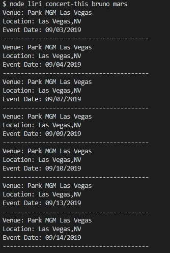

# LIRI BOT

Liri will search Spotify for songs, Bands in Town for concerts, and OMDB for movies. It also reads input from a text file called random.txt and executes all of instruction in the file. For every search, the results are logged into a file called log.txt.

The application uses the following technologies to provide search results to the user:
  * Axios
  * Dotenv
  * Moment
  * Node-Spotify-Api

Liri takes in one of the following commands:

   * `concert-this` 
    
      **node liri concert-this bruno mars**

   * `spotify-this-song`
    
      **node liri spotify-this-song man in the mirror**

   * `movie-this`
    
      **node liri movie-this forrest gump**

   * `do-what-it-says`
    
      **node liri do-what-it-says**

      

View (demo) [https://jt0398.github.io/Liri-Node-App/]

